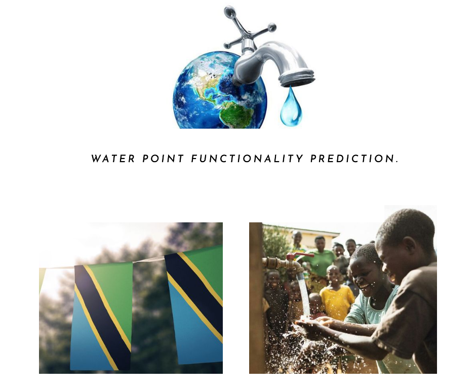

## Tanzania Water Wells Model.

## Table of Contents.
- [Project Overview](#project-overview)
- [Dataset](#dataset)
- [Exploratory Data Analysis](#exploratory-data-analysis)
- [Data Preprocessing](#data-preprocessing)
- [Model Development](#model-development)
- [Model Evaluation](#model-evaluation)
- [Final Model Recommendation](#final-model-recommendation)
- [Conclusion](#conclusion)
- [Technologies Used](#Technologies_Used)

## Project Overview.

This project aims to predict the functionality of water points in Tanzania. By leveraging machine learning techniques, we seek to assist WaterAid in prioritizing and tailoring interventions to improve water access and sustainability.

## Dataset.

The dataset was provided by [Taarifa](https://taarifa.org/) and the [Tanzanian Ministry of Water](https://www.maji.go.tz/) contains extensive information about various water points across Tanzania. 
The dataset used for this project includes various attributes of water points, such as geographical location, construction year, and water quality. The target variable is the `status_group`, which indicates whether a water point is functional, non-functional, or functional but needs repair.
Additional features in this dataset are found [here.](https://www.drivendata.org/competitions/7/pump-it-up-data-mining-the-water-table/page/25/)

## Exploratory Data Analysis.

Extensive exploratory data analysis (EDA) was conducted to understand the distribution and relationships of different features.
 - Distribution of the Functional and Non-Functional Water wells.
   

 - Distribution of the Functional and Non-Functional Water wells.
   

## Data Preprocessing.

Data preprocessing steps included:
- Handling missing values
- Encoding categorical variables
- Feature scaling
- Feature selection

We utilized techniques such as SMOTE to address class imbalance and ensure robust model training.

## Model Development.

We developed and compared several machine learning models:
- Dummy Classifier
- Decision Tree
- Random Forest
- K-Nearest Neighbors (KNN)
- XGBoost

## Model Evaluation.

Models were evaluated using various metrics, including accuracy, precision, recall, F1 score, and ROC AUC score. The Random Forest classifier emerged as the top performer with the following metrics:
- **Accuracy:** 80%
- **Precision:** 80%
- **Recall:** 80%
- **F1 Score:** 80%
- **ROC AUC Score:** 88%

## Final Model Recommendation.

Based on the evaluation, we recommend the Random Forest classifier as the final model due to its high accuracy and robustness.

## Conclusion.

In conclusion, the Random Forest classifier is the optimal choice for predicting water point functionality in Tanzania. This model will support WaterAid(our stakeholder) in making data-driven decisions to enhance water access and sustainability in Tanzania.

## Technologies Used.
- Python
- Pandas
- Numpy
- Matplotlib
- Seaborn
- Sklearn

>## *“Nothing in life is to be feared; it is only to be understood. Now is the time to understand more, so that we may fear less.”* - Marie Curie.
